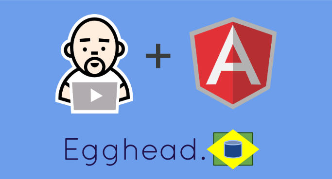

# Egghead.br
##### Repositório para traduções das legendas e transcrições dos exemplos originalmente postados em [egghead.io](https://egghead.io/)

## Como Utiizar

Estarão listados abaixo, o link para vídeo original e o link referente as explicações, traduzidas, dos comentários sobre os vídeos no curso da **Thinkster.io** [neste link.](http://www.thinkster.io/pick/GtaQ0oMGIl/a-better-way-to-learn-angularjs)

### Relação de Vídeos

* [01 - Binding](https://egghead.io/lessons/angularjs-binding) | [resumo](resumo/001-binding.md)
* [02 - Controllers](https://egghead.io/lessons/angularjs-controllers) | [resumo]()
* [03 - Dot](https://egghead.io/lessons/angularjs-the-dot) | [resumo]()
* [04 - Sharing Data Between Controllers](https://egghead.io/lessons/angularjs-sharing-data-between-controllers) | [resumo]()
* [05 - Defining a method on the scope](https://egghead.io/lessons/angularjs-defining-a-method-on-the-scope) | [resumo]()

---

### por [eo_op](https://github.com/eoop/eo_op)

 Este obra foi licenciado sob uma Licença <a rel="license" href="http://creativecommons.org/licenses/by-nc-sa/3.0/br/deed.pt_BR">Creative Commons Atribuição-NãoComercial-CompartilhaIgual 3.0 Brasil</a>.
